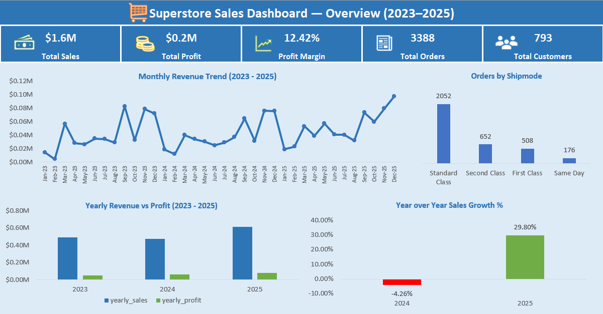
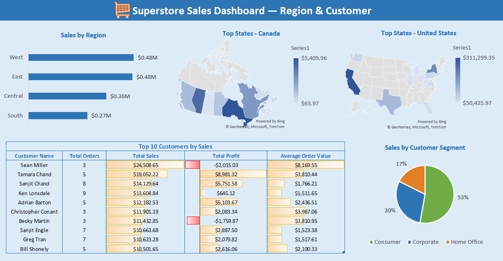
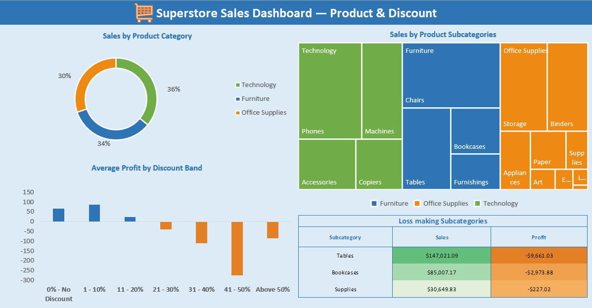

# 🛒 Superstore Sales Analysis — SQL Project
SQL-based exploratory data analysis of a global retail superstore dataset using PostgreSQL and pgAdmin. The project covers data validation, cleaning, and business insight generation across sales, customers, products, and regions — visualised in an interactive Excel dashboard.

---

## 🛠️ Tools Used

- **PostgreSQL** — querying and analysis
- **pgAdmin 4** — database management and query execution
- **Microsoft Excel 365** — dashboard and visualisation

---

## 📂 Project Structure

```

├── data/
│   ├── superstore_sales_orders.csv
├── sql/
│   ├── 01_create_table.sql
│   ├── 02_data_validation.sql
│   └── 03_eda.sql
├── query_outputs/
│   ├── 01_create_table.pdf
│   └── 02_data_validation_outputs.pdf
│   └── 03_eda_outputs.pdf
├── screenshots/
│   ├── dashboard_1_overview.png
│   ├── dashboard_2_region_customer.png
│   └── dashboard_3_product_discount.png
├── dashboard/
│   ├── superstore_sales_dashboard.xlsx
│   ├── superstore_sales_dashboard.pdf
└── README.md

```

---

## 📊 Dataset

- **Source:** Superstore Sales Dataset - Tableau Public Sample Data (https://public.tableau.com/app/sample-data/sample_-_superstore.xls)
- **Records:** 10,194 rows
- **Period:** 2023 — 2025 (2026 data excluded as year is incomplete)
- **Columns:** 21 — including order details, customer info, product hierarchy, sales, profit, and discount

---

## 🔍 Project Workflow

### 1. Database Setup & Data Import

- Created a new PostgreSQL database `superstore_db` in pgAdmin
- Created the `orders` table with correct column names and data types using `01_create_table.sql`
- Imported the CSV using pgAdmin's Import/Export tool with default CSV settings
- Default QUOTE and ESCAPE settings were retained — the dataset contains product names with single quotes (e.g. O'Sullivan) and double quotes (e.g. 6") which PostgreSQL's default CSV parser handles correctly using the `""` double-quote escape standard. Setting a custom ESCAPE character caused import errors.
- Verified import with `SELECT COUNT(*) FROM orders;` — confirmed 10,194 rows loaded successfully

### 2. Data Validation

- Checked row counts, null values across all 21 columns, duplicate row IDs, and invalid values
- Validated date ranges, discount bounds (0–1), and categorical consistency
- Found no null values or duplicate row IDs
- Identified 2,465 future order dates — investigated and confirmed the dataset legitimately extends through December 2026, not a data quality issue
- Decided to exclude 2026 data from analysis as the year is incomplete and would skew year-over-year comparisons

### 3. Exploratory Data Analysis

Created a filtered view `orders_2023_2025` restricting analysis to three complete calendar years 2023–2025.

Key questions answered:
- What are the overall business KPIs — total sales, profit, orders, and customers?
- How did sales and profit trend year over year and month over month?
- Which regions, and states generate the most revenue?
- Which ship modes are most used and how long does shipping take?
- Which customer segments drive the most sales?
- Who are the top 10 customers by revenue?
- Which product categories and sub-categories are most profitable?
- Which sub-categories are loss making?
- How does discounting impact profitability?

### 4. SQL Techniques Used

| Technique | Where used |
|---|---|
| CTEs | Yearly and monthly trend analysis |
| Window functions — LAG | Year over year and month over month growth % |
| Window functions — DENSE_RANK | Top states by country, subcategory ranking |
| PARTITION BY | Ranking within each country, ranking within each category |
| Subquery | Subcategory performance |
| DATE_TRUNC | Monthly aggregation |
| TO_CHAR | Extracting month name from date |
| EXTRACT | Year extraction from order date |
| CASE | Discount band classification |
| DISTINCT | Categorical consistency checks |
| COUNT(*) vs COUNT(column) | Null checks across all columns |
| CREATE OR REPLACE VIEW | Filtered dataset for 2023–2025 analysis |

### 5. Excel Dashboard

Exported SQL query results as CSV and built three dashboards in Excel 365:

**Dashboard 1 — Sales Overview**
- KPI tiles: Total Sales, Total Profit, Profit Margin %, Total Orders, Total Customers
- Monthly Revenue Trend (line chart)
- Yearly Revenue vs Profit (clustered column chart)
- Year over Year Sales Growth % (column chart)
- Orders by Shipping Mode (column chart)

**Dashboard 2 — Regional & Customer Analysis**
- Top States - Canada (map chart)
- Top States - USA (map chart)
- Sales by Region (bar chart)
- Sales by Customer Segment (pie chart)
- Top 10 Customers by Sales (formatted table)

**Dashboard 3 — Product & Discount Analysis**
- Sales by Product Category (donut chart)
- Sales by Product Subcategories (treemap)
- Loss Making Subcategories (formatted table)
- Average Profit by Discount Band (column chart)

---

## 📈 Dashboard

### Overview


### Regional & Customer Analysis


### Product & Discount Analysis


---

## 💡 Key Findings

- **Sales dipped in 2024** by 4.26% but recovered strongly in 2025 with 29.80% growth
- A consistent **seasonal sales pattern** is observed across all three years — January and February consistently mark the lowest sales period, while November and December see a significant spike, likely driven by end-of-year purchasing and holiday demand. This pattern holds with very few deviations across 2023, 2024, and 2025
- **Standard Class** is the most used ship mode with 2,052 orders out of 3,388 total orders (60.6%)
- **West and East regions** together account for approximately 60% of total revenue (≈$0.48M each out of $1.6M total), making them the two dominant regions
- **California** leads US states in total sales while **Ontario** tops Canadian provinces, highlighting the two key geographic revenue hubs across North America
- **Consumer segment** drives the highest sales volume across all three years (53%)
- Revenue appears to be well distributed across customers — the **top 10 customers** account for approximately 8.9% ($0.14M out of $1.58M total), suggesting limited dependency on any single client
- **Technology** leads in both total revenue ($567K) and total profit ($96K), while **Office Supplies** edges ahead on profit margin at 17.63% vs 16.87%. **Furniture** significantly underperforms with only a 3.06% margin despite being the second highest revenue category at $535K
- Sub-categories such as  **Tables, Bookcases, and Supplies** are loss making despite significant sales volume
- **Discounts above 20%** consistently result in negative average profit — heavy discounting is hurting the business

---

## ⚙️ How to Run

1. **Download the dataset**
   - Download Superstore Sales CSV from the source link in the Dataset section above

2. **Set up PostgreSQL database**
   - Open pgAdmin
   - Right click Databases → Create → Database
   - Name it `superstore_db`

3. **Create the table**
   - Open Query Tool in pgAdmin
   - Run `01_create_table.sql` — creates the orders table with correct column names and data types

4. **Import the data**
   - Right click the `orders` table → Import/Export Data
   - Select your CSV file
   - Format: CSV, Header: Yes, Delimiter: comma
   - Leave QUOTE and ESCAPE as default — do not customise escape character
   - Click OK

5. **Verify the import**
   - Run `SELECT COUNT(*) FROM orders;` — should return 10,194 rows
   - Run `SELECT * FROM orders LIMIT 10;` to preview data

6. **Validate the data**
   - Run `02_data_validation.sql` — all checks documented with findings

7. **Run the analysis**
   - Run `03_eda.sql` — execute each query individually using F5 in pgAdmin
   - Export results as CSV using the download button in the results panel
   - Query screenshots and outputs are available in the `query_outputs/` folder for reference without running the SQL locally.

8. **View the dashboard**
   - Open `superstore_sales_dashboard.xlsx` in Excel 365

---

## 👩‍💻 Author

**Asiya Nizam**
Data Analyst
[GitHub](https://github.com/asiyanizam01-da)
